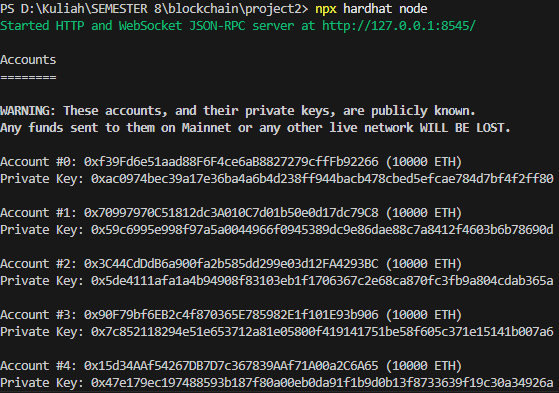
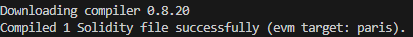
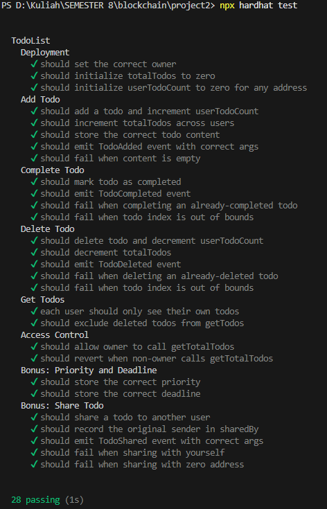
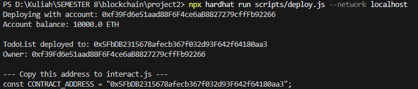
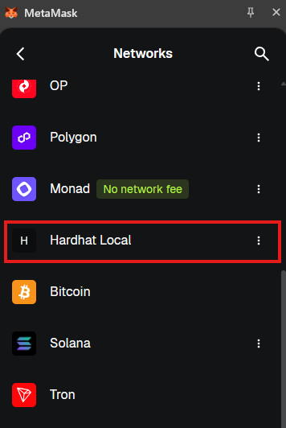
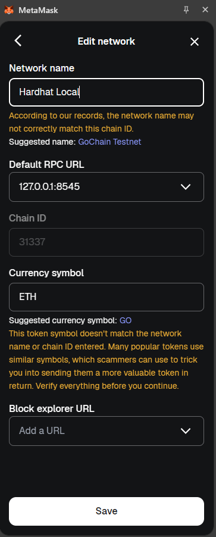
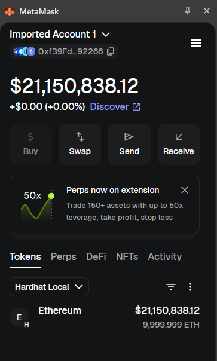
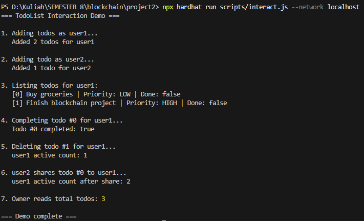

# Final Project Blockchain - To-Do List

## Deskripsi

Aplikasi To-Do List terdesentralisasi (dApp) yang mengintegrasikan smart contract Solidity dengan frontend berbasis React dan Vite. Aplikasi ini memungkinkan pengguna untuk mencatat aktivitas tugas, menentukan batas waktu (deadline), mengatur tingkat prioritas, menandai tugas selesai, serta membagikan tugas secara peer-to-peer ke alamat wallet lain langsung di atas jaringan blockchain lokal.


## Anggota Kelompok 9

- Nicholas Marco Weinandra (5027221042)
- Muhammad Arsy Athallah
- Muhammad Rifqi Oktaviansyah (5027221067)

## Tech Stack
- **Smart Contract:** Solidity v0.8.20 + Hardhat
- **Frontend:** React + Vite
- **Web3 Library:** ethers.js (v6)
- **Wallet Extension:** MetaMask

## Fitur

### Fitur Wajib
- **Tambah Todo** — user dapat menambahkan item todo baru dengan konten teks
- **Tandai Selesai** — user dapat menandai todo sebagai completed
- **Hapus Todo** — user dapat menghapus todo yang tidak diperlukan
- **List Pribadi** — setiap address memiliki daftar todo yang terpisah

### Fitur Bonus (Fungsional)
- **Deadline** — setiap todo bisa diberi batas waktu (unix timestamp)
- **Priority Level** — tiga tingkat prioritas: LOW, MEDIUM, HIGH
- **Shared Todo** — user dapat berbagi todo ke address lain
- **Filter** — tampilkan tugas berdasarkan status: Semua / Aktif / Selesai
- **Drag & Drop Reorder** — urutkan tugas dengan seret-lepas (urutan disimpan per-akun di localStorage)
- **Deadline Reminder** — badge "Terlewat" / "Segera" dan banner pengingat untuk tugas yang jatuh tempo < 24 jam

##  Bonus Features (Extra Points)

Berikut adalah fitur bonus tambahan yang diimplementasikan untuk memperoleh poin ekstra. Total potensi **+25 poin** (sesuai ketentuan, bonus maksimum dihitung **+15 poin**).

| Bonus | Poin | Status | Implementasi |
|---|---|:---:|---|
| **Deploy ke Sepolia Testnet** | +5 | ✅ | Konfigurasi jaringan `sepolia` di Hardhat + script `deploy:sepolia` (lihat [Deploy ke Sepolia](#deploy-ke-sepolia-testnet-bonus)) |
| **Frontend Hosting** | +5 | ✅ | Config siap-pakai untuk Vercel (`vercel.json`) & Netlify (`netlify.toml`) (lihat [Frontend Hosting](#frontend-hosting-bonus)) |
| **Event Listening (Real-time)** | +5 | ✅ | UI update otomatis via `contract.on(...)` saat event `TodoAdded/Completed/Deleted/Shared` terjadi |
| **Multiple Network Support** | +3 | ✅ | Switch Local ⇄ Sepolia langsung dari UI; alamat kontrak dipilih otomatis per `chainId` |
| **Dark Mode** | +2 | ✅ | Toggle Light/Dark di header, preferensi disimpan di `localStorage` |
| **Transaction History** | +3 | ✅ | Riwayat transaksi user (add/complete/delete/share) + tautan ke Etherscan saat di testnet |
| **Loading Skeleton** | +2 | ✅ | Placeholder berdenyut (shimmer) saat data dimuat, menggantikan spinner |

### Penjelasan Detail

#### 1. Deploy ke Sepolia Testnet (+5)
Smart contract dapat di-deploy ke jaringan publik **Sepolia**, bukan hanya jaringan lokal. `hardhat.config.js` membaca `SEPOLIA_RPC_URL` dan `PRIVATE_KEY` dari file `.env`, lalu kontrak dipasang dengan `npm run deploy:sepolia`. Setelah deploy, alamat kontrak dapat diverifikasi publik di Etherscan. Panduan lengkap ada di [bagian Deploy ke Sepolia](#deploy-ke-sepolia-testnet-bonus).

#### 2. Frontend Hosting (+5)
Frontend dapat di-hosting ke **Vercel** atau **Netlify** sehingga dApp dapat diakses lewat link publik. Disediakan `frontend/vercel.json` dan `frontend/netlify.toml` yang sudah mengatur build command (`npm run build`), output (`dist`), dan SPA fallback. Alamat kontrak diatur lewat Environment Variable di dashboard hosting (`VITE_SEPOLIA_CONTRACT`).

#### 3. Event Listening / Real-time (+5)
Aplikasi mendengarkan event smart contract menggunakan `contract.on(...)`. Saat ada event (`TodoAdded`, `TodoCompleted`, `TodoDeleted`, `TodoShared`) yang relevan untuk akun aktif, daftar tugas otomatis disegarkan **tanpa reload**. Termasuk skenario menarik: ketika user lain **membagikan** tugas ke alamat kita (`TodoShared(from, to=kita)`), tugas baru langsung muncul. Indikator **● Live** di account bar menandakan listener sedang aktif. Listener dibersihkan (`removeAllListeners`) saat akun/jaringan berganti untuk mencegah memory leak.

#### 4. Multiple Network Support (+3)
Konfigurasi jaringan dipusatkan di `frontend/src/utils/contract.js` pada objek `NETWORKS` (keyed per `chainId`). `getContract()` otomatis memilih alamat kontrak sesuai jaringan aktif. Sebuah **dropdown jaringan** di account bar memungkinkan user berpindah antara **Hardhat Local** dan **Sepolia** langsung dari UI (memicu `wallet_switchEthereumChain`, dan menambah jaringan otomatis bila belum ada).

#### 5. Dark Mode (+2)
Tombol toggle Light/Dark di header mengganti tema gelap/terang dengan mengubah atribut `data-theme` pada `<html>`. Seluruh warna memakai CSS variables, dan preferensi tema disimpan di `localStorage` agar konsisten setelah reload.

#### 6. Transaction History (+3)
Setiap transaksi write (tambah/selesai/hapus/bagikan) dicatat ke dalam riwayat berisi **jenis aksi, hash transaksi, waktu, dan status** (Diproses → Berhasil/Gagal). Riwayat disimpan per-akun di `localStorage`. Pada jaringan dengan block explorer (Sepolia), hash menjadi **tautan langsung ke Etherscan**.

#### 7. Loading Skeleton (+2)
Saat data tugas pertama kali dimuat dari blockchain, ditampilkan **skeleton placeholder** dengan animasi shimmer (bukan spinner berputar), memberikan persepsi loading yang lebih halus dan modern.

## Arsitektur Smart Contract

| Komponen | Detail |
|---|---|
| **State Variables** | `owner`, `totalTodos`, `userTodos` (mapping), `userTodoCount` (mapping) |
| **Functions** | `addTodo`, `completeTodo`, `deleteTodo`, `getTodo`, `getTodos`, `getTotalTodos`, `shareTodo` |
| **Modifiers** | `onlyOwner`, `todoExists` |
| **Events** | `TodoAdded`, `TodoCompleted`, `TodoDeleted`, `TodoShared` |
| **Mappings** | `mapping(address => Todo[])`, `mapping(address => uint256)` |

## Cara Menjalankan

### Prerequisites

- Node.js v18+
- MetaMask Browser Extension
- Git

### Installation

```bash
npm install
```

### Compile

```bash
npx hardhat compile
```

### Test

```bash
npx hardhat test
```

Untuk coverage:

```bash
npx hardhat coverage
```

### Deploy di Local

Terminal 1 — jalankan local blockchain:

```bash
npx hardhat node
```

Terminal 2 — deploy contract:

```bash
npx hardhat run scripts/deploy.js --network localhost
```

### Interact

Setelah deploy, salin alamat contract ke `scripts/interact.js` pada variabel `CONTRACT_ADDRESS`, lalu:

```bash
npx hardhat run scripts/interact.js --network localhost
```

### Deploy ke Sepolia Testnet (Bonus)

1. Buat file `.env` di root project (salin dari `.env.example`) lalu isi:

   ```
   SEPOLIA_RPC_URL=https://ethereum-sepolia-rpc.publicnode.com
   PRIVATE_KEY=<private_key_wallet_testing_kamu>
   ```

   > Gunakan akun **khusus testing**, jangan akun utama. Pastikan akun punya sedikit Sepolia ETH dari faucet (mis. https://sepoliafaucet.com).

2. Deploy:

   ```bash
   npm run deploy:sepolia
   ```

3. Salin alamat kontrak yang muncul, lalu set di frontend lewat env var `VITE_SEPOLIA_CONTRACT` (file `frontend/.env`) **atau** langsung di `frontend/src/utils/contract.js` pada `NETWORKS[11155111].contractAddress`.

4. Di MetaMask, pindah ke jaringan **Sepolia** (atau gunakan dropdown jaringan di dalam aplikasi).

### Frontend Hosting (Bonus)

Frontend siap di-deploy ke **Vercel** atau **Netlify** (config sudah disediakan).

**Vercel:**
1. Import repo di [vercel.com](https://vercel.com).
2. Set **Root Directory** = `frontend`.
3. Tambahkan Environment Variable `VITE_SEPOLIA_CONTRACT` = alamat kontrak Sepolia.
4. Deploy — Vercel otomatis mendeteksi Vite (`vercel.json` sudah disertakan).

**Netlify:**
1. Import repo di [netlify.com](https://netlify.com).
2. Set **Base directory** = `frontend` (build & publish sudah diatur di `netlify.toml`).
3. Tambahkan Environment Variable `VITE_SEPOLIA_CONTRACT`.
4. Deploy.

> Catatan: dApp yang di-hosting harus diakses dengan MetaMask terhubung ke jaringan tempat kontrak di-deploy (Sepolia), karena Hardhat Local hanya bisa diakses dari mesin lokal.

## Contract Address


```
Contract Address : 0x5FbDB2315678afecb367f032d93F642f64180aa3
Network          : Hardhat Local (chainId 31337)
Deployer         : 0xf39Fd6e51aad88F6F4ce6aB8827279cffFb92266
```

## Struktur Project

```
project2/
├── contracts/
│   └── TodoList.sol
├── test/
│   └── TodoList.test.js
├── scripts/
│   ├── deploy.js
│   └── interact.js
├── frontend/
│   └── src/
│       ├── components/
│       │   ├── ConnectWallet.jsx       # Koneksi MetaMask
│       │   ├── AccountBar.jsx          # Akun + jumlah tugas + network switcher + Live
│       │   ├── NetworkWarning.jsx      # Warning jika jaringan tidak didukung
│       │   ├── NetworkSwitcher.jsx     # (Bonus) Switch Local ⇄ Sepolia
│       │   ├── StatusBanner.jsx        # Feedback transaksi & error
│       │   ├── ThemeToggle.jsx         # (Bonus) Toggle Dark Mode
│       │   ├── TodoForm.jsx            # Tambah tugas (write)
│       │   ├── TodoList.jsx            # Daftar tugas (read)
│       │   ├── TodoItem.jsx            # Aksi: selesai / hapus / bagikan (write)
│       │   ├── TodoSkeleton.jsx        # (Bonus) Loading skeleton
│       │   ├── TransactionHistory.jsx  # (Bonus) Riwayat transaksi
│       │   └── ShareForm.jsx           # Bagikan tugas (write)
│       ├── utils/
│       │   ├── contract.js         # NETWORKS (multi-network), ABI + events
│       │   └── helpers.js          # getContract, formatter, explorer, parseError
│       └── App.jsx                 # State management & orkestrasi Web3 + event listening
├── hardhat.config.js
├── package.json
├── .gitignore
└── README.md
```

### Pemenuhan Requirement Frontend & Integrasi

| Komponen | Implementasi |
|---|---|
| **Components (min 4)** | 12 komponen terpisah di `frontend/src/components/` |
| **Read Operations (min 2)** | `getTodos()` + `userTodoCount(address)` |
| **Write Operations (min 2)** | `addTodo`, `completeTodo`, `deleteTodo`, `shareTodo` |
| **Loading States** | State `loading` + status `pending` di setiap transaksi |
| **Error Handling** | `parseError()` → pesan ramah pengguna |
| **Wallet Connection** | `eth_requestAccounts` + listener `accountsChanged` |
| **Network Detection** | Deteksi `chainId` 31337 + warning + tombol switch jaringan |
| **Responsive Design** | CSS mobile-first dengan media query |

## Test Coverage

| Kategori | Jumlah Test Cases |
|---|---|
| Deployment | 3 |
| Add Todo (Positive + Event + Negative) | 5 |
| Complete Todo (Positive + Event + Negative) | 4 |
| Delete Todo (Positive + Event + Negative) | 5 |
| Get Todos | 2 |
| Access Control | 2 |
| Bonus: Priority & Deadline | 2 |
| Bonus: Share Todo | 5 |
| **Total** | **28** |

## Demo Video

Demo lengkap fitur dApp dari connect wallet hingga transaksi berhasil:

https://drive.google.com/file/d/1bXIWcWl7BbS1azSO2Xb6V-82-eFiKrXi/view?usp=sharing

## Screenshot


| No | Screenshot | Keterangan |
|---|---|---|
| 1 | <br> | `npx hardhat compile` berhasil |
| 2 |  | `npx hardhat test` semua passed |
| 3 |  | Output contract address |
| 4 | <br><br>| MetaMask terhubung ke Hardhat Local |
| 5 |  | Transaksi addTodo berhasil |
| 6 |  | Transaksi completeTodo berhasil |

## MetaMask Setup

1. Buka MetaMask → **Add Network** → **Add a network manually**
2. Isi konfigurasi:
   - Network Name: `Hardhat Local`
   - RPC URL: `http://127.0.0.1:8545`
   - Chain ID: `31337`
   - Currency Symbol: `ETH`
3. Import akun: gunakan salah satu private key yang ditampilkan saat `npx hardhat node`

## Cara Menjalankan 
### Prerequisites
- Node.js v18+
- MetaMask Browser Extension
- Git

### 1. Clone & Install Dependencies
```bash
# Clone repositori ini
git clone [url-repo]
cd blockchain-project3-team-alpha

# Install dependencies untuk root (Hardhat/Backend)
npm install

# Install dependencies untuk Frontend
cd frontend
npm install
cd ..
```
### 2. Jalankan Local Blockchain (Hardhat Node)
Buka terminal utama kamu, lalu nyalakan simulator blockchain lokal:
```bash
npx hardhat node
```
Biarkan terminal ini tetap terbuka dan menyala.

### 3. Deploy Smart Contract
Buka terminal baru (Terminal 2), jalankan perintah migrasi ini untuk memasang kontrak pintar ke localhost:
```bash
npx hardhat run scripts/deploy.js --network localhost
```
Salin alamat kontrak yang muncul setelah deploy berhasil.

### 4. Konfigurasi Alamat Kontrak di Frontend
Buka berkas `frontend/src/utils/contract.js`, lalu perbarui nilai variabel `CONTRACT_ADDRESS` dengan alamat kontrak baru yang baru saja kamu salin:
```bash
export const CONTRACT_ADDRESS = "ISI_ALAMAT_KONTRAK_KAMU_DISINI";
```

### 5. Jalankan Aplikasi Frontend React
Masuk ke direktori folder frontend pada Terminal 2, lalu nyalakan server lokal:
```bash
cd frontend
npm run dev
```
Buka browser kamu dan akses link: `http://localhost:5173`